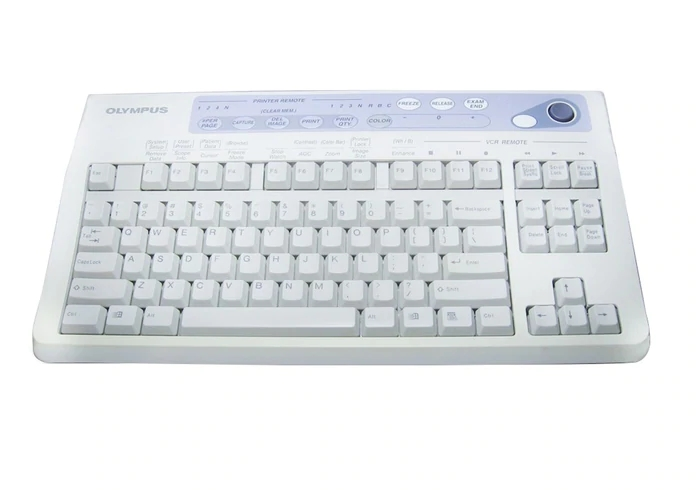

# About

This is a Linux driver for the Olympus MAJ-1428 medical keyboard.



The source code has been intentionally over-annotated for educational purposes.

# Context

For whatever reason, the 5.13 kernel's HID driver is missing support for 3 of the 9 special keys on the top of the keyboard (in the purple area). I wanted to write a driver that would fix that, and also map the rest of the special keys to function keys instead of normal characters.

# Setup

# Install kernel headers

Before you start, you'll need to install the header files for your kernel.

Run: 

```bash
$ sudo apt install linux-headers-$(uname -r)
```

# Compile the driver

Next, run `make` in the root directory of this repository.

This will compile your kernel module (.ko file).


You might get a warning that says:

`Skipping BTF generation for hid-olympus-maj1428.ko due to unavailability of vmlinux`

That's okay.

# Load the kernel module

Run:

```bash
$ sudo insmod hid-olympus-maj1428.ko 
```

Now you can use the device as needed.

If you want to go back to using the built-in kernel driver instead, you can remove this kernel module:


```bash
$ sudo rmmod hid-olympus-maj1428.ko 
```